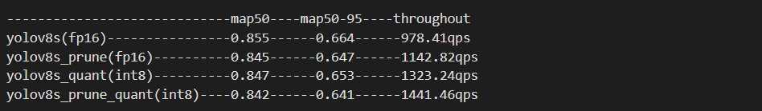

# Pruning

## 模型剪枝 ™️

#### 1. Torch-Pruning


* paper: [DepGraph: Towards Any Structural Pruning](https://arxiv.org/abs/2301.12900)
* github: [https://github.com/VainF/Torch-Pruning](https://github.com/VainF/Torch-Pruning)

关于模型剪枝这边推荐一种**通用的结构化剪枝工具**[Torch-Pruning](https://github.com/VainF/Torch-Pruning),不同于torch.nn.utils.prune中利用掩码(Masking)实现的“模拟剪枝”, Torch-Pruning采用了一种名为DepGraph的非深度图算法, 能够“物理”地移除模型中的耦合参数和通道-->🚀详细讲解请移步官方repo。

(1) install

```
pip install torch-pruning
```

(2) yolov8_prune

```
git clone https://github.com/ultralytics/ultralytics.git 
cp yolov8_pruning.py ultralytics/
cd ultralytics 
git checkout 44c7c3514d87a5e05cfb14dba5a3eeb6eb860e70 # for compatibility
python yolov8_pruning.py
```

注意： 模型训练 ultralytics 版本一定和剪枝版本对应，目前测试版本 ultralytics==8.0.90.

#### 2. Prune

剪枝原理探索

[点我](https://u1g62ufvk30.feishu.cn/docx/MVrfdvgZfo6cQ3xeSkEcBLcKnrf)

Yolov8的通道剪枝方案(bn剪枝):

---

训练baseline --> 稀疏化训练 --> 剪枝 --> 微调

步骤如下：

#### (1) 训练

```
from ultralytics import YOLO

# Load a model
# model = YOLO("yolov8n.yaml")  # build a new model from scratch
model = YOLO("best.pt")  # load a pretrained model (recommended for training)

# Use the model
model.train(data="XX.yaml", epochs=100, batch=32, amp=False)  # train the model

metrics = model.val()  # evaluate model performance on the validation set
# results = model("https://ultralytics.com/images/bus.jpg")  # predict on an image

```

#### (2) 稀疏化训练

```
# FILE: ultralytics/yolo/engine/trainer.py
...
# Backward
self.scaler.scale(self.loss).backward()

# <============ added
l1_lambda = 1e-2 * (1 - 0.9 * epoch / self.epochs)
for k, m in self.model.named_modules():
    if isinstance(m, nn.BatchNorm2d):
        m.weight.grad.data.add_(l1_lambda * torch.sign(m.weight.data))
        m.bias.grad.data.add_(1e-2 * torch.sign(m.bias.data))

# Optimize - https://pytorch.org/docs/master/notes/amp_examples.html
if ni - last_opt_step >= self.accumulate:
    self.optimizer_step()
    last_opt_step = ni
...
```

#### (3) 剪枝

```
python prune.py  
```

#### (4) 微调

* 去掉 l1 约束
* 避免从yaml 导入模型结构

```
# FILE: ultralytics/yolo/engine/model.py
# self.trainer.model = self.trainer.get_model(weights=self.model if self.ckpt else None, cfg=self.model.yaml)
# self.model = self.trainer.model
self.trainer.model = self.model.train()
```

#### (5) onnx

```
from ultralytics import YOLO
import sys

# Load a model
model = YOLO("/home/DONG/PRUNE/ultralytics/runs/detect/train6/weights/best.pt")  # load a pretrained model (recommended for training)

# success = model.export(format="onnx", opset=13, half=True)  # export the model to ONNX format
success = model.export(format="onnx", simplify=True, opset=13, half=True) 
print(success)
```

#### (6) engine

```
trtexec --onnx=best.onnx  --saveEngine=best.engine --fp16
```

### 3. 部署

[https://github.com/cvdong/YOLO_TRT_SIM](https://github.com/cvdong/YOLO_TRT_SIM)

剪枝比例：50%
性能对比：tensorrt(3090)


完！


